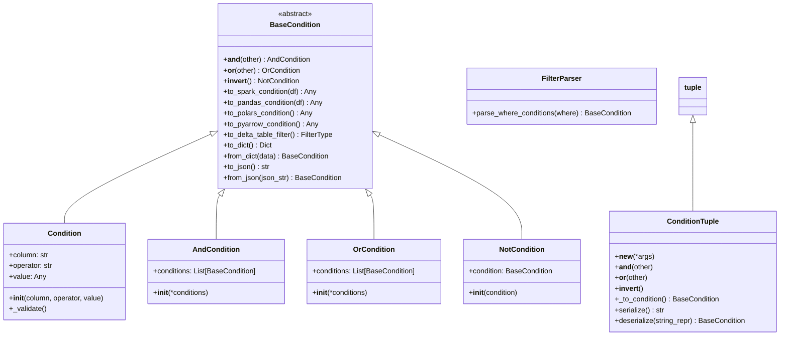
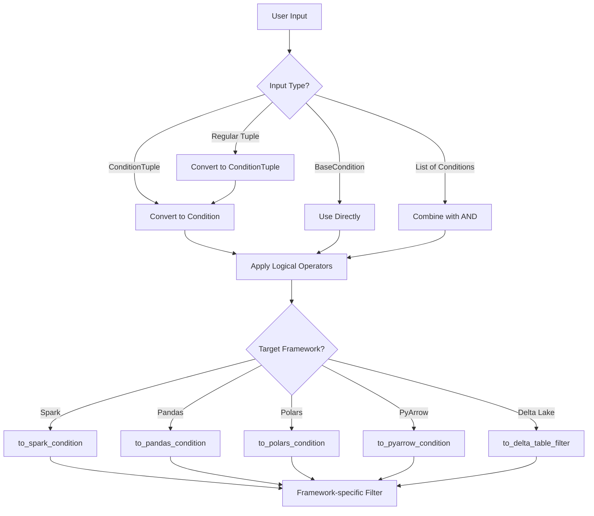
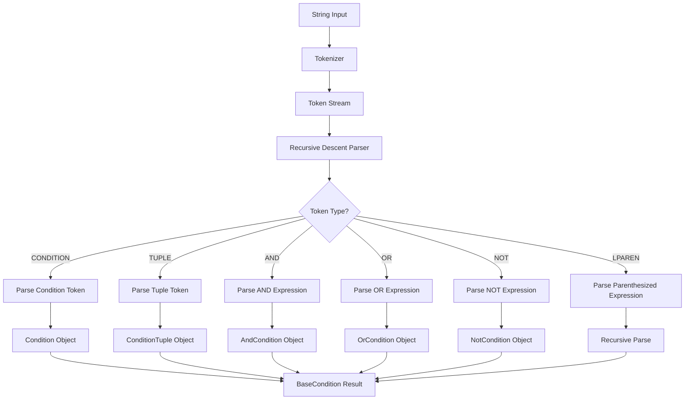

# Feature Store SDK Filters Documentation

## Overview

The `feature_store_sdk/filters.py` module provides a production-ready filter DSL (Domain Specific Language) for building complex filter conditions using familiar Python operators. It enables intuitive condition building with support for multiple data processing frameworks including Spark, Pandas, Polars, PyArrow, and Delta Lake.

## Key Features

- **Python-style operators**: Use `&`, `|`, and `~` for logical operations
- **Multi-framework support**: Convert conditions to Spark, Pandas, Polars, PyArrow, and Delta Lake formats
- **Serialization**: JSON serialization/deserialization support
- **Type safety**: Comprehensive validation and error handling
- **Flexible API**: Multiple ways to create and combine conditions

## Class Hierarchy



## Core Components

### BaseCondition (Abstract Base Class)

The foundation class that defines the interface for all filter conditions. Provides:

- **Logical operators**: `&` (AND), `|` (OR), `~` (NOT)
- **Framework conversion methods**: Convert to different data processing frameworks
- **Serialization support**: JSON serialization and deserialization

### Condition Class

Represents a single filter condition with three components:
- **column**: Column name to filter on
- **operator**: Comparison operator (==, !=, >, >=, <, <=, in, not_in, is_null, is_not_null, between, starts_with, ends_with, contains)
- **value**: Value to compare against (optional for null checks)

#### Supported Operators

| Operator | Description | Example |
|----------|-------------|---------|
| `==` | Equality | `c("age", "==", 25)` |
| `!=` | Inequality | `c("status", "!=", "INACTIVE")` |
| `>` | Greater than | `c("score", ">", 80)` |
| `>=` | Greater than or equal | `c("age", ">=", 18)` |
| `<` | Less than | `c("price", "<", 100)` |
| `<=` | Less than or equal | `c("rating", "<=", 5)` |
| `in` | In list | `c("country", "in", ["US", "UK"])` |
| `not_in` | Not in list | `c("status", "not_in", ["BANNED"])` |
| `is_null` | Null check | `c("email", "is_null")` |
| `is_not_null` | Not null check | `c("phone", "is_not_null")` |
| `between` | Range check | `c("age", "between", (18, 65))` |
| `starts_with` | String prefix | `c("name", "starts_with", "John")` |
| `ends_with` | String suffix | `c("email", "ends_with", "@company.com")` |
| `contains` | String contains | `c("description", "contains", "premium")` |

### Compound Conditions

#### AndCondition
Represents AND logic between multiple conditions. All conditions must be true.

#### OrCondition
Represents OR logic between multiple conditions. At least one condition must be true.

#### NotCondition
Represents NOT logic (negation) of a condition.

### ConditionTuple

A tuple subclass that supports logical operators, making it easy to build complex conditions:

```python
# Using the c() helper function
from feature_store_sdk.filters import c

# Simple conditions
basic_filter = c("age", ">", 25)

# Complex conditions with operators
complex_filter = c("age", ">", 25) & (c("country", "==", "US") | c("segment", "==", "PREMIUM"))
```

## Filter Processing Flow



## Framework Conversions

### Spark SQL
Converts conditions to Spark Column expressions using PySpark functions:
```python
condition.to_spark_condition(df)
# Returns: pyspark.sql.Column
```

### Pandas
Converts conditions to boolean masks for DataFrame filtering:
```python
condition.to_pandas_condition(df)
# Returns: pandas.Series (boolean)
```

### Polars
Converts conditions to Polars expressions:
```python
condition.to_polars_condition()
# Returns: polars.Expr
```

### PyArrow
Converts conditions to PyArrow compute expressions:
```python
condition.to_pyarrow_condition()
# Returns: pyarrow.compute.Expression
```

### Delta Lake
Converts conditions to Delta Lake filter format:
```python
condition.to_delta_table_filter()
# Returns: FilterType (tuples or list of tuples)
```

## Usage Examples

### Basic Usage

```python
from feature_store_sdk.filters import c

# Simple condition
age_filter = c("age", ">", 25)

# Multiple conditions with AND
where_conditions = [
    c("age", ">", 25),
    c("status", "==", "ACTIVE")
]

# Using logical operators
complex_filter = c("age", ">", 25) & c("country", "==", "US")
or_filter = c("country", "==", "US") | c("country", "==", "UK")
not_filter = ~c("status", "==", "BANNED")
```

### Advanced Combinations

```python
# Complex nested conditions
where = [
    c("age", ">", 25),
    (c("country", "==", "US") | c("segment", "==", "PREMIUM")),
    ~c("status", "==", "BANNED")
]

# String operations
text_filters = [
    c("email", "ends_with", "@company.com"),
    c("name", "starts_with", "John"),
    c("description", "contains", "premium")
]

# Range and list operations
range_filters = [
    c("age", "between", (18, 65)),
    c("country", "in", ["US", "UK", "CA"]),
    c("status", "not_in", ["BANNED", "INACTIVE"])
]
```

### Serialization

```python
# Serialize to JSON
condition = c("age", ">", 25)
json_str = condition.to_json()

# Deserialize from JSON
restored_condition = BaseCondition.from_json(json_str)

# Serialize complex conditions
complex_condition = c("age", ">", 25) & c("country", "==", "US")
complex_json = complex_condition.to_json()
```

## Parser Architecture



## API Reference

### Helper Functions

#### `c(*args) -> ConditionTuple`
Convenient helper to create ConditionTuple objects.

#### `condition(column, operator, value) -> Condition`
Create a Condition object directly.

#### `and_(*conditions) -> AndCondition`
Create an AND condition from multiple conditions.

#### `or_(*conditions) -> OrCondition`
Create an OR condition from multiple conditions.

#### `not_(condition) -> NotCondition`
Create a NOT condition from a condition.

### Parser Functions

#### `FilterParser.parse_where_conditions(where)`
Parse where conditions from various formats (ConditionTuple, BaseCondition, List, None).

#### `deserialize_condition(data)`
Deserialize condition from JSON string or dictionary.

#### `deserialize_condition_from_string(string_repr)`
Parse any condition string representation.

## Error Handling

The module provides comprehensive error handling:

- **Validation errors**: Invalid operators or missing values
- **Conversion errors**: Unsupported operations for specific frameworks
- **Parsing errors**: Invalid string representations
- **Type errors**: Incompatible operand types

## Best Practices

1. **Use the `c()` helper**: Most convenient way to create conditions
2. **Combine conditions logically**: Use `&`, `|`, `~` operators for readability
3. **Validate early**: Conditions are validated upon creation
4. **Choose appropriate operators**: Some operators may not be supported by all frameworks
5. **Handle serialization**: Use JSON methods for persistence
6. **Framework-specific considerations**: Be aware of framework limitations (e.g., Delta Lake doesn't support all string operations)

## Performance Considerations

- **Condition flattening**: Nested AND/OR conditions are automatically flattened
- **Lazy evaluation**: Framework conversions happen only when needed
- **Memory efficiency**: Tuple-based design minimizes memory overhead
- **Parser caching**: Consider caching parsed conditions for repeated use

## Dependencies

- **Core**: `typing`, `abc`, `json` (standard library)
- **Optional frameworks**: 
  - `pyspark` (for Spark support)
  - `pandas` (for Pandas support)
  - `polars` (for Polars support)
  - `pyarrow` (for PyArrow support)
  - `deltalake` (for Delta Lake support)